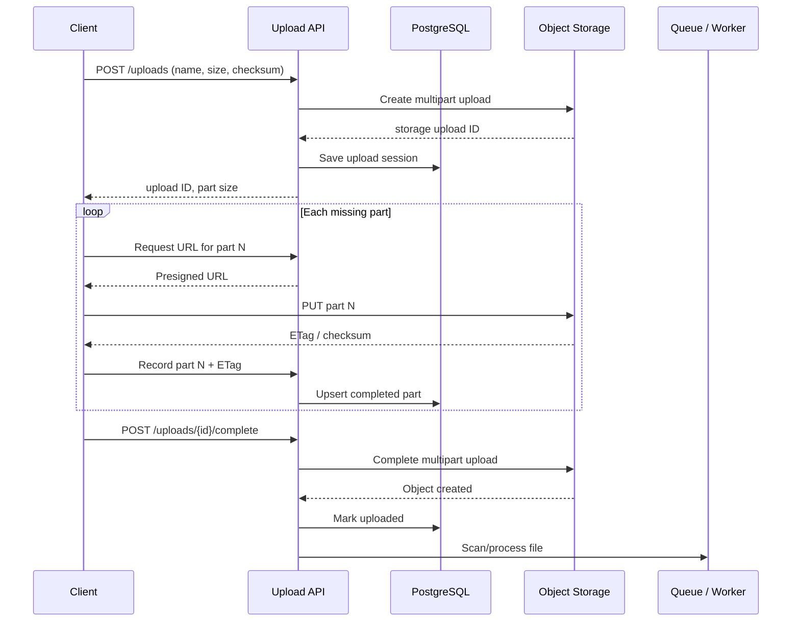

# Bulk File Upload System Design — Screening Eagle Panel

A candidate described this round as a two-hour panel with two interviewers. The interviewers were willing to explain the problem and the discussion covered both system design and data structures.

The reported question was roughly:

> Design an API for uploading a large file, say 1 GB. Where would you store it? If the connection dies after 500 MB, how does the client continue with only the remaining data?

This page is how I would work through it in the interview. The key is not to jump straight to an endpoint. First agree on what “500 MB uploaded” actually means.

## Start with a few questions

I would ask these before drawing anything:

- Is this browser, mobile, desktop, or device-to-cloud traffic?
- Is 1 GB typical or the maximum?
- Do we run on AWS, GCP, or our own storage?
- Can the client upload chunks in parallel?
- Does resume need to work after the app restarts or only after a dropped connection?
- Do we need virus scanning or file conversion before the file is usable?
- Who may download the completed file?
- How long should an unfinished upload stay resumable?
- Does “uploaded” mean acknowledged by our API or durably stored in object storage?

Then I would state reasonable assumptions: authenticated client, AWS deployment, files up to 1 GB, resume across restarts, and a file is not visible to the rest of the product until final validation succeeds.

## Short answer first

Split the file into fixed-size parts and upload each part directly to object storage using presigned URLs. Keep an upload session in the application database. The session records the storage upload ID, file metadata, expected number of parts, and the parts acknowledged by storage.

For a 1 GB file with 64 MiB parts, there are 16 parts. If the connection dies after eight complete parts, the client asks for upload status and sends parts 9–16. If part 9 was only half transmitted, it was never acknowledged as complete, so the client sends part 9 again. It does not restart the first eight.

On AWS, this maps directly to S3 multipart upload. S3 creates the final object only after the complete call and joins parts in part-number order. A failed part can be retried without touching successful parts. [AWS multipart upload overview](https://docs.aws.amazon.com/AmazonS3/latest/userguide/mpuoverview.html)

## The shape of the system



The file bytes should not travel through the Go service unless there is a hard product requirement for that. Direct-to-object-storage upload avoids tying up application connections, memory, CPU, and network bandwidth for every 1 GB transfer. The API remains the control plane: authentication, authorization, session state, presigned URLs, completion, and audit records.

## API contract

### 1. Start an upload

```http
POST /v1/uploads
Idempotency-Key: 4bb80c73-...
Content-Type: application/json

{
  "file_name": "bridge-scan.bin",
  "content_type": "application/octet-stream",
  "size_bytes": 1073741824,
  "checksum_sha256": "optional-full-file-checksum"
}
```

```json
{
  "upload_id": "upl_01J...",
  "part_size_bytes": 67108864,
  "part_count": 16,
  "expires_at": "2026-09-11T10:00:00Z"
}
```

The idempotency key prevents a retry of the create request from opening two storage uploads for the same user action.

Validate the declared size and content type here. Generate the object key on the server; do not allow the client to choose an arbitrary bucket path.

### 2. Get URLs for parts

The API can issue one URL at a time or a small batch:

```http
POST /v1/uploads/upl_01J.../parts/urls

{"part_numbers": [1, 2, 3, 4]}
```

```json
{
  "parts": [
    {"part_number": 1, "url": "https://..."},
    {"part_number": 2, "url": "https://..."}
  ]
}
```

The presigned URL should be short-lived and restricted to the intended object, upload ID, and part number. The client may upload a few parts concurrently, but concurrency should be bounded rather than starting all parts at once.

### 3. Record an uploaded part

After storage acknowledges a part, the client sends its ETag or checksum to the API:

```http
PUT /v1/uploads/upl_01J.../parts/8

{
  "etag": "etag-returned-by-storage",
  "size_bytes": 67108864,
  "checksum": "part-checksum"
}
```

Make this an upsert keyed by `(upload_id, part_number)`. A retry with the same values is harmless. A different ETag for the same part number replaces the old part only if that is an intentional retry.

The storage provider remains the authority on whether a part exists. Our database is useful for fast status responses, ownership, expiry, and audit, but completion should be checked against storage rather than trusting a client claim.

### 4. Resume after failure

```http
GET /v1/uploads/upl_01J...
```

```json
{
  "status": "uploading",
  "part_size_bytes": 67108864,
  "part_count": 16,
  "completed_parts": [1, 2, 3, 4, 5, 6, 7, 8],
  "missing_parts": [9, 10, 11, 12, 13, 14, 15, 16]
}
```

The answer to the candidate's 500 MB failure case is here: the client resumes from confirmed part boundaries. It uploads the missing part numbers, not an arbitrary “remaining 500 MB” byte stream.

There is an important distinction:

- If 500 MB means five 100 MB parts received successful responses, those five parts are safe.
- If the connection died halfway through the fifth part, only the first four are confirmed. Retry the whole fifth part.
- If uploads run in parallel, the server might have parts 1–6 and 8 while part 7 failed. Return a set of completed or missing part numbers; a single byte offset is no longer enough.

S3 also provides `ListParts`, which can be used to reconcile the application record with what storage has actually accepted. Keep the part number and ETag returned for each successful part because the completion request needs them. [AWS multipart upload process](https://docs.aws.amazon.com/AmazonS3/latest/userguide/mpuoverview.html)

### 5. Complete the upload

```http
POST /v1/uploads/upl_01J.../complete
Idempotency-Key: 1225b62e-...
```

The API verifies:

1. The caller owns the upload.
2. The session is still active.
3. Every expected part exists.
4. Part sizes are correct, except for the final part.
5. Stored bytes add up to the declared file size.
6. Checksums are present when required.

It then calls the storage complete operation with ordered part numbers and ETags. Two complete requests can race, so serialize completion with a database state transition or compare-and-swap:

```sql
UPDATE uploads
SET status = 'completing'
WHERE id = $1 AND status = 'uploading';
```

Only the request that updates one row performs completion. A retry reads the existing state and returns the completed file if it is already done.

Do not expose the object as ready for normal use until the storage completion and required validation have finished.

### 6. Cancel an upload

```http
DELETE /v1/uploads/upl_01J...
```

This aborts the storage multipart upload and marks the session cancelled. Incomplete parts cost money until they are completed or removed, so also configure an object-storage lifecycle rule to abort stale uploads automatically. AWS explicitly recommends `AbortIncompleteMultipartUpload` for this. [S3 incomplete-upload lifecycle rule](https://docs.aws.amazon.com/AmazonS3/latest/userguide/mpu-abort-incomplete-mpu-lifecycle-config.html)

## Data model

```text
uploads
  id                  string / UUID, primary key
  tenant_id           string
  user_id             string
  object_key          string, unique
  storage_upload_id   string, unique
  file_name           string
  content_type        string
  expected_size       bigint
  part_size           integer
  part_count          integer
  full_checksum       string, nullable
  status              uploading | completing | uploaded | processing | ready | failed | cancelled
  expires_at          timestamp
  created_at          timestamp
  completed_at        timestamp, nullable

upload_parts
  upload_id           foreign key
  part_number         integer
  etag                string
  checksum            string, nullable
  size_bytes          integer
  completed_at        timestamp
  primary key (upload_id, part_number)
```

For a 1 GB limit, a row per part is simple and easy to inspect. The in-memory data structure used during completion can be a map from part number to metadata, followed by a sorted slice for the storage request. A bitmap is compact for “which parts are present?”, but it does not replace the ETag/checksum map.

This is probably where the panel's data-structures angle enters the discussion:

- **Sequential upload:** highest confirmed contiguous part or byte offset is enough.
- **Parallel upload:** use a set/bitmap of completed part numbers.
- **Completion:** sort parts by number, or fill a pre-sized slice at index `partNumber - 1`.
- **Arbitrary byte ranges:** merge intervals, but fixed part numbers are much simpler and should be preferred here.

## What happens on failure?

### Client timed out, but storage may have accepted the part

Do not immediately upload a duplicate under a new part number. Query status first. If the same part number is uploaded again in S3 multipart upload, it replaces the previous value for that part, which makes retry manageable.

### Client recorded the part, but the response was lost

`PUT /parts/{number}` is idempotent. Sending the same ETag again produces the same state.

### Database is down while uploading

Existing presigned URLs may still succeed at storage. When the API recovers, reconcile with `ListParts`. This is why storage is the source of truth for received bytes.

### Complete succeeded in storage, but the API response was lost

The retry should inspect both the session and object storage. If the object already exists with the expected size/checksum, mark the session completed and return success. Do not create a second object.

### Worker fails during virus scan or conversion

The uploaded object remains in a quarantined prefix/state. Retry processing from a durable queue. Keep `uploaded`, `processing`, and `ready` separate so consumers never mistake “bytes received” for “safe to use.”

### User never returns

Expire the application session and abort the storage upload. Keep the storage lifecycle rule as a final safety net.

## Integrity and security

- Authenticate every control-plane request and scope the upload to a tenant/user.
- Use server-generated object keys; keep the original filename as metadata only.
- Limit declared size, number of active uploads, part count, and request rate.
- Make presigned URLs short-lived and part-specific.
- Require HTTPS.
- Validate per-part checksums where supported and verify a full-file checksum before marking the file ready. S3 supports part and full-object checksum validation; a mismatch fails completion rather than silently storing corrupted data. [S3 multipart checksums](https://docs.aws.amazon.com/AmazonS3/latest/userguide/mpuoverview.html#checksums-with-multipart-upload-operations)
- Encrypt storage at rest and use tightly scoped service roles.
- Keep files private by default. Downloads should use authorization plus short-lived URLs.
- Scan untrusted files and do not trust content type or filename extension alone.
- Record who created, completed, downloaded, or deleted an inspection file.

For Screening Eagle, inspection data may belong to critical infrastructure projects. Tenant isolation, audit trails, retention, and data residency deserve explicit discussion even if the interviewer does not mention them first.

## Scaling the design

The application API handles small metadata requests; object storage handles the data path. That makes API instances stateless and horizontally scalable.

PostgreSQL is sufficient for upload-session state. Partitioning is unnecessary until the numbers show otherwise. Index active-session lookups by owner/status and expiry cleanup by `expires_at`.

The client can upload parts concurrently to improve throughput. Start with three to five concurrent parts and make it configurable. More parallelism is not automatically faster and can hurt mobile clients or saturate a local connection.

Emit metrics for:

- uploads started, completed, cancelled, failed, and expired;
- completion rate and end-to-end duration by file-size bucket;
- part retry count and checksum failures;
- active and stale sessions;
- bytes in incomplete storage parts;
- processing queue age and failure rate.

Alerts should focus on user impact: completion success drops, resume failures rise, or processing age exceeds the product expectation.

## Alternative: offset-based resumable upload

If direct multipart upload is unavailable, the application can expose a protocol based on offsets:

```http
PATCH /v1/uploads/upl_01J...
Upload-Offset: 524288000
Content-Length: 67108864

<next chunk bytes>
```

The server only accepts the request when `Upload-Offset` equals its durable current offset. After a timeout, the client queries the server for the committed offset and resumes there. This is the model used by resumable-upload protocols such as tus and by cloud-storage resumable sessions.

It is a good answer when the interview asks for a storage-independent protocol, but on AWS I would still prefer direct S3 multipart uploads. Proxying all bytes through the backend adds cost and another bottleneck without helping the product in the normal case.

## A Go-shaped service boundary

Do not spend the system-design round writing all of this. If the panel asks how the code would be organized, keep storage behind a small interface:

```go
type UploadedPart struct {
	Number   int
	ETag     string
	Checksum string
	Size     int64
}

type MultipartStore interface {
	Start(ctx context.Context, objectKey string) (storageUploadID string, err error)
	SignPart(ctx context.Context, objectKey, storageUploadID string, partNumber int) (string, error)
	ListParts(ctx context.Context, objectKey, storageUploadID string) ([]UploadedPart, error)
	Complete(ctx context.Context, objectKey, storageUploadID string, parts []UploadedPart) error
	Abort(ctx context.Context, objectKey, storageUploadID string) error
}
```

The domain service owns authorization, state transitions, idempotency, and validation. The adapter owns S3-specific calls. Unit-test the state transitions with a fake store; integration-test the adapter against real-compatible object storage. Do not mock every internal function.

## How I would present it in the room

A useful order for the first 15 minutes:

1. Clarify clients, file limits, cloud, parallelism, durability, and post-upload processing.
2. Say “object storage, not the application server's disk or the database.”
3. Draw create → upload parts → status/resume → complete.
4. Walk through the 500 MB timeout using actual part numbers.
5. Explain why confirmed part state comes from storage.
6. Add idempotency and the completion race.
7. Cover cleanup, checksum, authorization, scanning, and observability.
8. Only then discuss scale or alternatives.

A concise spoken answer:

> I would use a resumable multipart upload to object storage. The API creates a session and returns an upload ID and part size. The client uploads numbered parts directly using presigned URLs and records each successful ETag. If the connection drops after 500 MB, it asks for the session status. Confirmed parts remain in storage; it retries any unconfirmed part and sends only the missing part numbers. When every part exists, the API completes the multipart upload atomically and moves the file into validation. The control API is idempotent, unfinished sessions expire, and a lifecycle rule cleans up abandoned parts.

Then stop and let the panel choose where to go deeper.

## Follow-ups worth practising

- Why object storage instead of PostgreSQL or local disk?
- How do you choose part size?
- Can parts arrive out of order?
- What if the client lies about a completed part?
- What happens if two completion requests arrive together?
- How do you resume when uploads are parallel?
- How do you verify that the assembled object is not corrupt?
- How do you keep one tenant from accessing another tenant's upload?
- How do you clean up abandoned files without deleting active slow uploads?
- How would the design change for a browser, mobile app, or field device with intermittent connectivity?
- How would you support GCP instead of AWS?
- How would you test the failure between storage completion and the database update?
- What do you monitor, and what would page the on-call engineer?

## Mistakes to avoid

- Sending a 1 GB request through a normal API handler and holding it in memory.
- Saying “resume from byte 500 MB” without explaining how the server knows those bytes are durable.
- Tracking only a byte offset while also claiming parts upload in parallel.
- Trusting the client's completed-parts list without checking storage.
- Forgetting idempotency on create and complete.
- Treating an S3 ETag as a guaranteed full-file MD5 checksum.
- Forgetting abandoned multipart parts continue to consume storage.
- Marking the file ready before checksum, scanning, or required processing completes.
